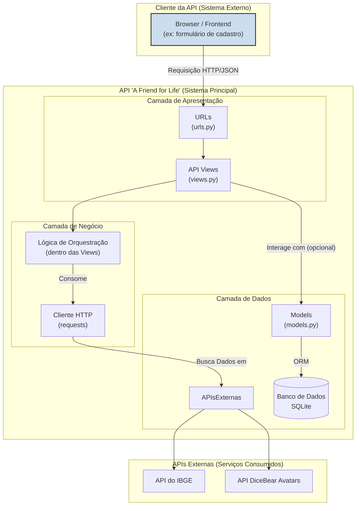

# Arquitetura da API - A Friend for Life

Este documento descreve a arquitetura da camada de API construída sobre a aplicação web "A Friend for Life", detalhando seus componentes e o fluxo de comunicação em um modelo de camadas.

### 1. Visão Geral

A API foi desenvolvida utilizando o **Django REST Framework (DRF)** sobre a aplicação Django existente. A arquitetura segue um padrão em camadas, separando as responsabilidades de apresentação e negócio, e atuando como um orquestrador que consome serviços externos para enriquecer a funcionalidade da plataforma principal.

### 2. Arquitetura em Camadas

O diagrama a seguir apresenta a arquitetura em camadas do sistema, ilustrando a interação entre os componentes internos e os serviços externos consumidos.

### 3. Explicação da Arquitetura em Camadas

*   **Camada de Apresentação:**
    *   **URLs (`urls.py`):** Define os endpoints da API (ex: `/api/localidades/estados/`). É a porta de entrada para todas as requisições.
    *   **API Views (`views.py`):** Recebe a requisição da URL e atua como o "controlador" principal da lógica.

*   **Camada de Negócio:**
    *   **Lógica de Orquestração:** Representa o código dentro das nossas `API Views` que decide quais APIs externas chamar, como processar os dados e como formatar a resposta JSON. **Nesta arquitetura, os Serializers não são necessários**, pois a transformação de dados é feita diretamente na view.

*   **Camada de Dados:**
    *   **Cliente HTTP (`requests`):** Componente responsável por realizar a comunicação de saída com as APIs externas.
    *   **Models (`models.py`):** Embora não sejam serializados diretamente, os modelos (como `UserProfile`) são consultados para obter informações necessárias para as chamadas externas (ex: obter o `email` para gerar um avatar).
    *   **Banco de Dados (SQLite):** A camada de persistência onde os dados da aplicação são armazenados.

*   **APIs Externas:**
    *   **API do IBGE:** Fonte externa de dados geográficos.
    *   **API DiceBear Avatars:** Fonte externa para a geração de imagens de avatares.

Este modelo demonstra como a nossa API funciona como um orquestrador: ela recebe uma requisição, consome um ou mais serviços externos, e combina/transforma os dados para entregar uma resposta final ao cliente, sem a necessidade de serializar modelos locais.

### 4. Definição dos Endpoints e Modelos de Dados

#### Modelos de Dados Principais
A API interage primariamente com o seguinte modelo de dados para obter informações de entrada:
*   **`UserProfile` (`perfil/models.py`):** Utilizado para obter dados como o `estado_id` e o `email` do usuário, que servem de base para as chamadas às APIs externas.

#### Endpoints da API
A API implementa os seguintes endpoints para fornecer seus serviços:

| Método | Rota | Descrição da Funcionalidade |
| :--- | :--- | :--- |
| `GET` | `/api/localidades/estados/` | Retorna a lista de estados do Brasil, atuando como um proxy com cache para a API do IBGE. |
| `GET` | `/api/localidades/estados/{id}/cidades/` | Retorna a lista de cidades de um estado específico, consumindo a API do IBGE. |
| `GET` | `/api/avatar/{email}/` | Gera e retorna a URL de um avatar único, consumindo a API da DiceBear. |

---

### 5. Especificação dos Protocolos de Comunicação

*   **Protocolo Principal:** HTTP/1.1. As requisições são feitas utilizando o método `GET`.
*   **Formato de Dados:** Todas as respostas da API são entregues no formato **JSON**.
*   **Protocolo de Interação:** REST (Representational State Transfer). Os recursos (localidades, avatares) são acessados através de URLs claras e padronizadas.

### 6. Tratamento de Erros

O Django REST Framework fornece um tratamento de erros padronizado e informativo, essencial para a integração de sistemas:

*   **`404 Not Found`:** É retornado quando uma requisição é feita para um recurso específico que não existe (ex: `GET /api/pets/999/` onde o pet com ID 999 não está no banco de dados).
*   **`400 Bad Request`:** Seria retornado caso a API tivesse endpoints `POST` ou `PUT` e os dados enviados pelo cliente fossem inválidos ou estivessem incompletos.
*   **`500 Internal Server Error`:** É retornado em caso de falhas inesperadas no servidor durante o processamento da requisição, impedindo que a operação seja concluída.

